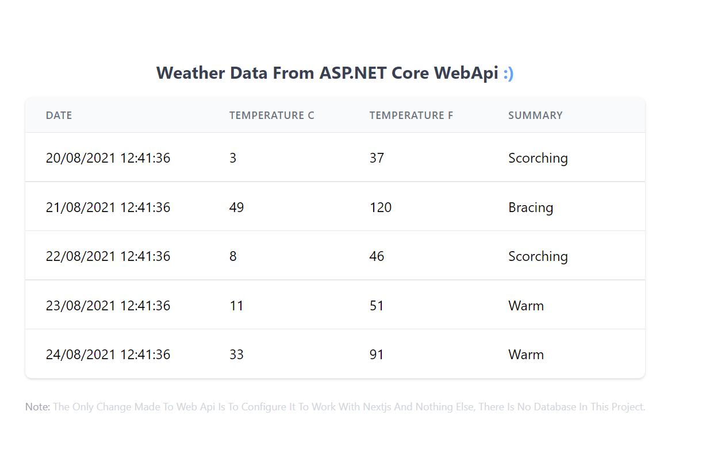

# Asp.Net 5 App With Next Js

this is a simple project combining ASP.net 5 with NextJs

 ## Requirement
 dotnet SDK 5
 latest node js
 
## Tutorial

Folder Structure

- create "src" folder
	 - inside "src" folder create "api" folder and "client" folder
- in "api" run this command `dotnet new webapi`
- in "client" run `npx create-next-app -e with-tailwindcss .`
in ASP install this package `microsoft.aspnetcore.spaservices.extensions`

- add those lines 
`services.AddSpaStaticFiles(config=>config.RootPath="out");`
the `out` is the name of published folder of next js
 add `app.UseSpaStaticFiles();` before `app.UseRouting();`
 and
 ```cs
 app.UseSpa(builder=>
{
	if(env.IsDevelopment())
	{
			builder.UseProxyToSpaDevelopmentServer("http://localhost:3000");
	}
});
 ```
 at the end of configure method.
 `http://localhost:3000` is the server nextjs runs on.

- and start coding :)

## note 
make sure both next js and asp. net are running and navigate to asp .net's server not next js 

## video tutorial
This project was based on this tutorial by raw coding:
[DotNet Api + Vitejs + Vuejs Setup for Dev & Prod - YouTube](https://www.youtube.com/watch?v=opHbgp2f128)
which is using ViteJs but i wanted to try Next js And suprise suprise it was the same steps.